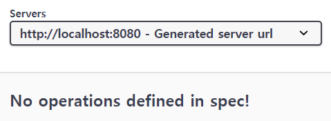
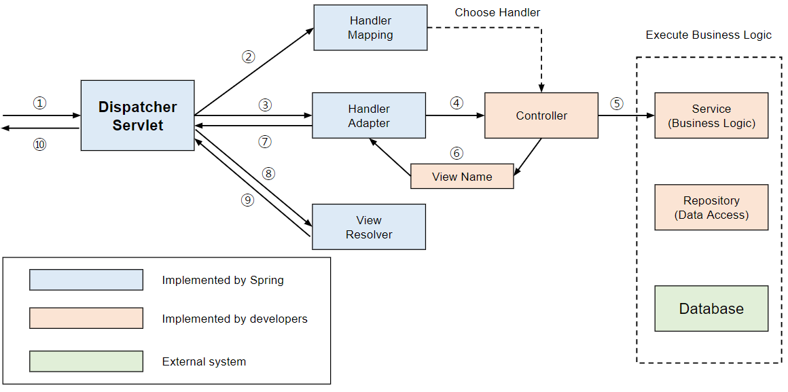
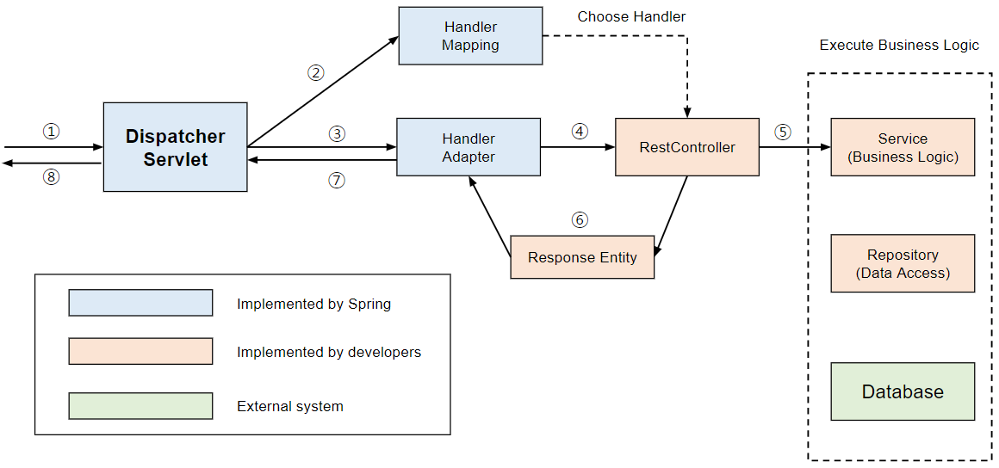
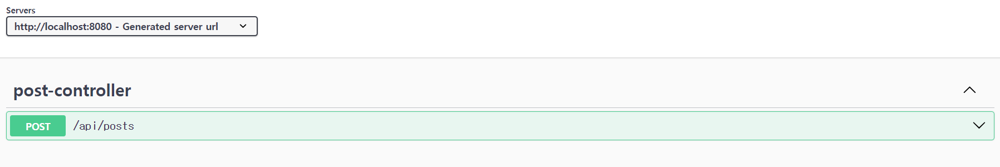

# 사건의 발단

컨트롤러, 서비스, 리포지토리를 모두 구현하고, Swagger를 이용해 구현이 잘 이루어졌는지 확인하려고 했는데, 다음과 같이 아무 것도 나타나지 않았다.



Swagger가 잘 작동하는 다른 코드와 비교해보니 차이는 애노테이션에 있었다.

@Controller를 사용하면 Swagger가 위와 같이 아무 것도 나타나지 않지만, @RestController를 사용하면 Swagger를 정상적으로 사용할 수 있다. 그렇다면, 두 애노테이션 간의 차이는 무엇이고, 왜 Swagger에서는 @RestController만 사용할 수 있을까?

# @Controller



1. 클라이언트가 보낸 요청을 DispatcherServlet이 받는다.
2. DispatcherServlet은 HandlerMapping를 호출하여 요청 정보인 URL을 분석하여 그 URL을 처리하는 적합한 컨트롤러를 선택한다.
3. DispatcherServlet이 HandlerAdapter를 호출하고, HandlerAdapter는 요청한 URL에 적합한 메서드를 찾는다.
4. HandlerAdapter가 Controller로 요청을 위임한다. Controller는 Business Logic을 처리하고, View에 전달할 결과를 Model 객체에 저장한다.
5. Controller는 view name을 DispatcherServlet에 리턴한다.
6. DispatcherServlet이 ViewResolver를 호출하여 Controller가 리턴한 view name을 기반으로 적합한 View를 찾는다.
7. DispatcherServlet이 View 객체에 처리 결과를 전달하여 보여준다.
8. View 객체는 해당하는 View를 호출한다. View는 Model 객체에 화면을 표시하는 데 필요한 객체를 가져와 화면에 처리하고, Client에 넘겨준다.

즉, @Controller는 **기본적으로** 요청을 처리하고, 뷰를 전달하기 위한 목적으로 사용된다. 뷰가 아닌 Response로 전달하고 싶으면, 해당 메서드 위에 @ResponseBody를 추가로 붙여야 한다.

# @RestController



과정은 @Controller에서와 비슷하지만, @Controller에서의 구조도와의 차이는 Controller 대신 RestController가, View Name 대신 Response Entity로 바뀌었다는 것이다.

즉, @RestController는 View가 아닌 ResponseEntity를 반환하기 위한 목적으로 사용된다. ResponseEntity는 Spring에서 지원하는 응답을 위한 객체이다. 결론은 @RestController = @Controller + @ResponseBody이다.

# @Controller를 사용하면, Swagger를 사용할 수 없는가?

비교 실험을 해본 결과, @Controller를 사용해도, 메서드에 @ResponseBody가 적용된다면, 그 메서드에 한정해서 사용할 수 있다.

아래는 비교 실험한 코드와 Swagger에서의 결과이다.

```java
@Controller
@RequestMapping("/api/posts")
@RequiredArgsConstructor
public class PostController {

	private final PostService postService;

	@PostMapping
	@ResponseBody
	public ResponseEntity<DataResponse<Void>> savePost(@RequestBody @Valid SavePostRequest request){
		postService.savePost(request);
		return ResponseEntity.ok(DataResponse.ok());
	}

	@GetMapping("/{id}")
	public ResponseEntity<FindPostResponse> findPost(@PathVariable Long id) {
		return ResponseEntity.ok(postService.findPostById(id));
	}

	@GetMapping("/list")
	public ResponseEntity<?> findPosts(@PageableDefault(size = 10, sort = "views", direction = Sort.Direction.DESC)
	Pageable pageable) {
		return ResponseEntity.ok(postService.findPostsWithPaging(pageable));
	}
	
}
```



위처럼 @ResponseBody를 붙인 savePost 메서드는 Swagger에 나타나지만, @ResponseBody를 붙이지 않은 findPost와 findPosts는 Swagger에 나타나지 않는다.

결론은 ResponseBody를 제공하는 메서드만 Swagger에 나타난다.